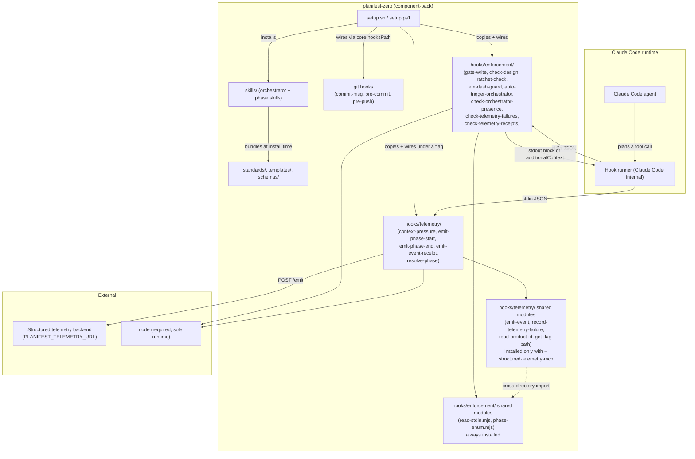

# Dependency Graph

## Component dependency diagram

---

## Edges that matter

**`hooks/telemetry/` imports from `hooks/enforcement/`, never the reverse.** The enforcement tree installs unconditionally. The telemetry tree installs only under `--structured-telemetry-mcp`. Any helper with an enforcement caller must therefore live in the always-present tree.

**`phase-enum.mjs` is the canonical phase enum.** It holds the five phase values (discovery, plan, implement, validate-and-accept, ship) and lives in the always-installed enforcement tree. `standards/telemetry-standards.md` mirrors the same enum.

**`resolve-phase.mjs` interposes on the Skill tool.** A `PreToolUse(Skill)` hook reads `tool_input.skill`, resolves the active pipeline phase, then re-execs `emit-phase-start.mjs`. A `Stop` hook re-execs `emit-phase-end.mjs` from a session marker file, cleared after use.

**Node is the sole runtime.** Every hook is a `.mjs` file invoked as `node <script>`. There is no `jq` dependency and no bash entry point, so the hooks run identically on macOS, Linux, and Windows.
