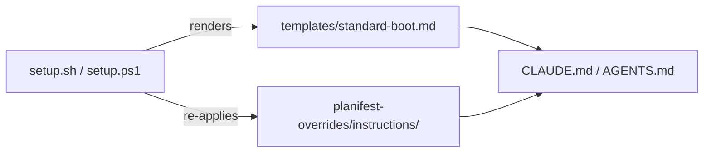

# Execution Plan - Context Mode Removal and Boot File Regeneration Fix

> Every requirement must be traceable to a user story or acceptance criterion.

**Skill:** [spec-agent](../skills/planifest-spec-agent/SKILL.md)
**Feature:** 0000029-context-mode-removal-and-boot-file-regeneration-fix
**Version:** 0.28.1
**Status:** active

## Active Skills

None.

## Functional Requirements Directory

| File | Requirement |
|------|------------|
| [req-001-boot-file-always-regenerates.md](requirements/req-001-boot-file-always-regenerates.md) | `write_boot_file`/`Write-BootFile` always overwrites the boot file instead of skip-if-exists |
| [req-002-drop-context-mode-from-boot-template.md](requirements/req-002-drop-context-mode-from-boot-template.md) | Remove the unconditional context-mode instruction from `templates/standard-boot.md` |
| [req-003-update-local-git-permission-override.md](requirements/req-003-update-local-git-permission-override.md) | Update `custom-001-local-git-only.md` to authorize pull/push/PR-create, commits to main and PR merges stay human-only |

## Non-Functional Requirements

Not applicable at a measurable-target level; internal tooling fix with no deployed runtime service. Correctness criterion is stated directly in each requirement's acceptance criteria (zero context-mode occurrences post-regeneration, override content preserved).

## API Summary

Not applicable, no API surface.

## Data Model Summary

Not applicable, no data ownership.

## Component Interactions

## Assumptions

| ID | Assumption | Impact if Wrong |
|----|-----------|----------------|
| A-001 | All durable local customization already lives in `planifest-overrides/instructions/`, never hand-typed directly into the boot file | Always-regenerate would silently drop customization not actually captured as an override |

## Open Questions

None.
