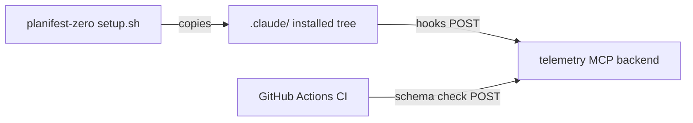

# Execution Plan - five-phase-planifest-zero

> Every requirement must be traceable to a user story or acceptance criterion.

**Skill:** [spec-agent](../skills/planifest-spec-agent/SKILL.md)
**Feature:** 0000031-five-phase-planifest-zero
**Version:** 0.2.0
**Status:** active

## Active Skills

None.

## Functional Requirements Directory

Functional requirements are split into individual files, one user story per file, at `plan/current/requirements/`.

| File | Requirement |
|------|------------|
| [req-001-rename-folder.md](requirements/req-001-rename-folder.md) | Rename `planifest-framework/` to `planifest-zero/` with every live reference updated |
| [req-002-single-route.md](requirements/req-002-single-route.md) | Remove the Change Pipeline, Fast Path, and Retrofit routes |
| [req-003-five-phases.md](requirements/req-003-five-phases.md) | Collapse ten phases into five and cut 21 skills to 12 |
| [req-004-setup-and-overrides.md](requirements/req-004-setup-and-overrides.md) | Keep setup and overrides functionally intact, with skill pruning on regeneration |
| [req-005-telemetry-only-mcp.md](requirements/req-005-telemetry-only-mcp.md) | Keep the telemetry MCP, purge every context-mode trace |
| [req-006-present-tense-docs.md](requirements/req-006-present-tense-docs.md) | Rewrite living docs to present state only |

## Non-Functional Requirements

| ID | Category | Requirement | Target | Measurement |
|----|----------|------------|--------|-------------|
| NFR-001 | Context cost | Orchestrator plus phase skill text shrinks | ≤ 50% of the current `skills/` total line count | `wc -l` over `skills/` before and after |
| NFR-002 | Test health | Full suite passes | `run-tests.sh` exits 0, zero failures | local run and CI |
| NFR-003 | Setup integrity | Fresh install works | `setup.sh claude-code --structured-telemetry-mcp` exits 0 in a temp clone, all hooks registered, exactly 12 skills | verify-by-execution |
| NFR-004 | Reference hygiene | Old name gone from live tree | zero `planifest-framework` hits outside `plan/changelog/`, `plan/_archive/`, git history | grep sweep |

## API Summary

Not applicable. No API is built or modified.

## Data Model Summary

Not applicable. No database. The component owns `plan/` artifacts, `docs/`, and telemetry markers as files.

## Component Interactions

## Assumptions

| ID | Assumption | Impact if Wrong |
|----|-----------|----------------|
| A-001 | The telemetry backend tolerates the five new phase values or is updated separately | CI telemetry job fails loudly; first five-phase run surfaces markers |
| A-002 | `context-pressure.mjs` is separable from context-mode (investigate at implement) | If entangled, it is deleted with its wiring and test per req-005 |
| A-003 | `plan/current/` artifact formats stay stable for this run | The old installed orchestrator could not resume the run |

## Open Questions

None. All questions raised at P0 were answered and are recorded in the build log.
