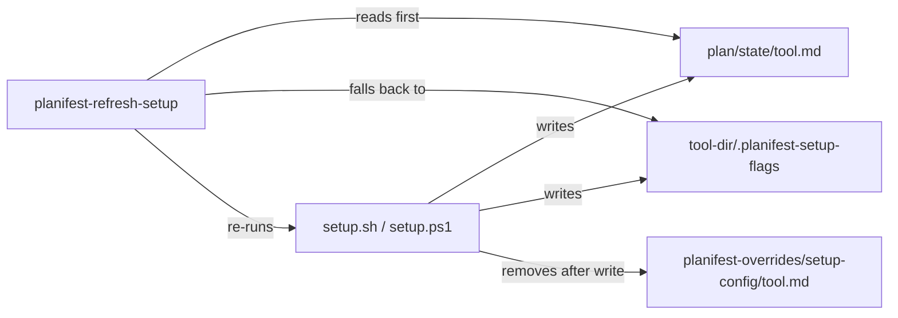

# Execution Plan - relocate-setup-config-to-plan-state

> Every requirement must be traceable to a user story or acceptance criterion.

**Skill:** [spec-agent](../../.claude/skills/planifest-spec-agent/SKILL.md)
**Feature:** 0000032-relocate-setup-config-to-plan-state
**Wave:** not waved
**Version:** 0.3.0
**Status:** active

## Active Skills

| Skill | Scope | Purpose |
|-------|-------|---------|
| none | | No capability skill applies to a bash, PowerShell, and markdown stack. |

## Functional Requirements Directory

Functional requirements are split into individual files, one user story per file, at `plan/current/requirements/`. All six derive from US-001.

| File | Requirement |
|------|------------|
| [req-001-bash-write-to-plan-state.md](requirements/req-001-bash-write-to-plan-state.md) | `setup.sh` writes the record to `plan/state/{tool}.md`, creating the folder. |
| [req-002-powershell-write-to-plan-state.md](requirements/req-002-powershell-write-to-plan-state.md) | `setup.ps1` mirrors req-001. |
| [req-003-inline-cleanup-of-old-record.md](requirements/req-003-inline-cleanup-of-old-record.md) | Both scripts remove the old record and emptied folder after a successful write. |
| [req-004-refresh-setup-reads-record-first.md](requirements/req-004-refresh-setup-reads-record-first.md) | Refresh-setup Step 3 reads and validates the record before the marker and hook inference. |
| [req-005-layout-docs-updated.md](requirements/req-005-layout-docs-updated.md) | Four layout docs describe `plan/state/` and stop describing `setup-config/`. |
| [req-006-superseding-adr.md](requirements/req-006-superseding-adr.md) | A superseding ADR records the relocation and marks 0000025 ADR 002 superseded. |

## Non-Functional Requirements

| ID | Category | Requirement | Target | Measurement |
|----|----------|------------|--------|-------------|
| NFR-001 | Idempotence | A repeat setup run on a migrated repo changes nothing but the timestamp. | Only the `writtenAt` field of `plan/state/claude-code.md` differs, and no removal line prints. | Test: run setup twice in a fixture repo, diff the record, grep stdout. |
| NFR-002 | Resilience | A failed write or removal never fails setup. | Exit code 0 with one warning line on stderr. | Test: read-only `plan/state/` and read-only `setup-config/` fixtures. |
| NFR-003 | Reviewability | The record stays git-tracked. | `git check-ignore plan/state/claude-code.md` exits non-zero. | Existing test assertion (c), moved to the new path. |

## API Summary

Not applicable. No API is built or modified, so no `openapi-spec.yaml` is produced.

## Data Model Summary

The record is a markdown file with one JSON block. No database, so no data contract file is produced. The manifest at `planifest-zero/component.yml` is the existing component's and is updated at P6.

| Entity | Owner Component | Key Fields | Relationships |
|--------|----------------|------------|--------------|
| Setup-config record (`plan/state/{tool}.md`) | planifest-zero (`setup.sh`, `setup.ps1`) | `tool`, `flags[]`, `backendUrl`, `writtenAt` | Read by `planifest-refresh-setup`. Reconciled with the gitignored marker on every setup run. |
| Marker (`{tool-dir}/.planifest-setup-flags`) | planifest-zero (unchanged) | `tool`, `flags[]`, `backendUrl`, `writtenAt`, `attemptStatus`, `attemptedCommand` | Second source for refresh-setup after the record. |

## Component Interactions

## Assumptions

Each is a risk item with likelihood: medium.

| ID | Assumption | Impact if Wrong |
|----|-----------|----------------|
| A-001 | The write path may create `plan/state/` itself. | First-run setup on a new repo warns and leaves no record. |
| A-002 | The old file's contents never need preserving, because the same run regenerates the record from its flags. | A flag set recorded only in the old file is lost on upgrade. |
| A-003 | `plan/` exists in every consumer repo before setup runs. | The write warns and continues, as for an unwritable folder. |

## Open Questions

Reported to the orchestrator - not filled in by assumption.

| ID | Question | Blocking |
|----|----------|----------|
| none | | |
