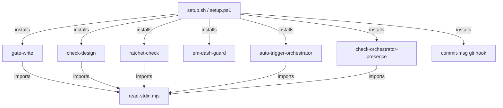

# Execution Plan - remove-telemetry-mcp

> Every requirement must be traceable to a user story or acceptance criterion.

**Skill:** [spec-agent](../skills/planifest-spec-agent/SKILL.md)
**Feature:** 0000033-remove-telemetry-mcp
**Wave:** not waved
**Version:** 0.4.0
**Status:** active

## Active Skills

| Skill | Scope | Purpose |
|-------|-------|---------|
| None | n/a | No skill applies to this stack. The work edits bash, PowerShell, Node hooks, and markdown directly. |

## Functional Requirements Directory

Functional requirements are split into individual files, one user story per file, at `plan/current/requirements/`.

Each file follows the naming convention `req-{NNN}-{kebab-slug}.md` and the [Requirement Template](../templates/requirement.template.md).

| File | Requirement |
|------|------------|
| [req-001-delete-telemetry-only-files.md](requirements/req-001-delete-telemetry-only-files.md) | Delete the 34 files that exist only to support telemetry. |
| [req-002-setup-sh-telemetry-removal.md](requirements/req-002-setup-sh-telemetry-removal.md) | Remove every telemetry block from planifest-zero/setup.sh. |
| [req-003-setup-ps1-telemetry-removal.md](requirements/req-003-setup-ps1-telemetry-removal.md) | Remove every telemetry block from planifest-zero/setup.ps1, mirroring req-002. |
| [req-004-upgrade-cleanup-of-telemetry-wiring.md](requirements/req-004-upgrade-cleanup-of-telemetry-wiring.md) | Add upgrade cleanup that strips prior telemetry wiring from an existing project. |
| [req-005-drop-product-id-gate.md](requirements/req-005-drop-product-id-gate.md) | Remove the product.yml top-level id field and the orchestrator's product-id hard stop. |
| [req-006-skills-and-templates-detelemetried.md](requirements/req-006-skills-and-templates-detelemetried.md) | Strip telemetry sections, frontmatter, and bundle references from skills and templates. |
| [req-007-docs-describe-no-telemetry.md](requirements/req-007-docs-describe-no-telemetry.md) | Update the living docs so none describe a telemetry system that no longer exists. |
| [req-008-test-suite-cleanup.md](requirements/req-008-test-suite-cleanup.md) | Delete telemetry-only test suites and edit mixed suites without masking a real regression. |

## Non-Functional Requirements

| ID | Category | Requirement | Target | Measurement |
|----|----------|------------|--------|-------------|
| NFR-001 | Clean removal | planifest-zero/ carries no telemetry marker outside deliberate history references. | A repository-wide grep of planifest-zero/ for the telemetry markers (telemetry, structured-telemetry-mcp, backend-url, emit_event) returns no match outside a changelog or an ADR history reference. | A dedicated test runs the grep and fails on any non-history match. |
| NFR-002 | No regression | Every surviving enforcement hook and the commit-msg git hook keep working. | All six surviving enforcement hooks (gate-write, check-design, ratchet-check, em-dash-guard, auto-trigger-orchestrator, check-orchestrator-presence) plus commit-msg install and fire after a fresh setup.sh or setup.ps1 run. | The existing enforcement test suites pass unchanged, with no suite edited to accommodate this feature. |
| NFR-003 | Idempotent cleanup | A second setup run on an already-cleaned project does nothing and says nothing. | Running setup twice on a project with no telemetry wiring left prints no removal line on the second run. | A dedicated test runs setup twice and asserts the second run's output contains no removal line. |

> "The system should be fast" is not a requirement. "p95 latency < 200ms for the primary endpoint" is.

## API Summary

Not applicable. This feature ships no API. No openapi-spec.yaml is produced.

## Data Model Summary

Not applicable. planifest-zero owns no data store. component.yml declares ownsData: false, so this feature has no data contract.

## Component Interactions

## Assumptions

Each is a risk item with likelihood: medium.

| ID | Assumption | Impact if Wrong |
|----|-----------|----------------|
| A-001 | No consumer depends on Zero's telemetry. | That consumer loses event emission with no migration path and must wire their own tool-level hooks. |
| A-002 | Removing a documented setup flag is a minor version bump, not a major one, because the product is pre-1.0. | The version understates the change for anyone reading tags alone. |
| A-003 | Every telemetry entry a prior setup run wrote into .claude/settings.json is identifiable by its command string. | Cleanup misses an entry and the broken reference survives. |

## Open Questions

Reported to the orchestrator, not filled in by assumption.

| ID | Question | Blocking |
|----|----------|----------|
| N/A | None. | N/A |
</content>
